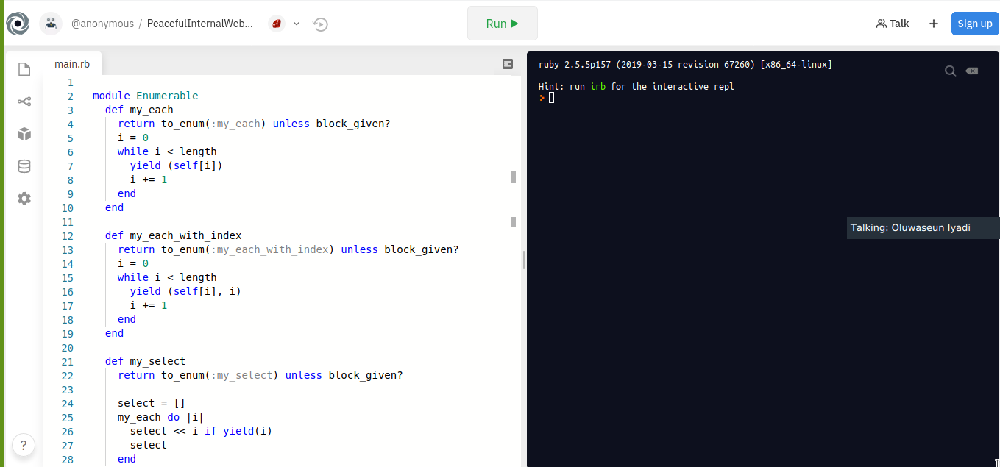

# Building-Blocks-Enumerable

This project consists of methods in re-creating enumerables.

## Project Requirements

Re-created Enumerable Methods

-   my_each
-   my_each_with_index
-   my_all?
-   my_none?
-   my_select
-   my_any
-   my_count
-   my_inject
-   my_map

## Live Demo

[Demo-Link](https://repl.it/@OseunIyadi/PeacefulInternalWebpage)

## Install

-   [Download](Clone the repository to your machine)

-   \$ git clone https://github.com/sneeu-leeu/Building-Blocks-Enumerable

-   Navigate to the project folder and execute "ruby my_enumerable.rb".

## Built With

-   Ruby

## Dependencies

> Refer to [Linters Config](https://github.com/sneeu-leeu/linters-config) for dependencies setup guide.

## 👤 Authors

-   Github: [@sneeu-leeu](https://github.com/sneeu-leeu)
-   Twitter: [@Stephan07484055](https://twitter.com/Stephan07484055)
-   Linkedin: [Stephan Annandale](https://www.linkedin.com/in/stephan-annandale-a4b4931a9/)

-   Github: [@emmanuellekamwa](https://github.com/emmanuellekamwa)
-   Twitter: [@AlixKamwa](https://twitter.com/AlixKamwa)
-   Linkedin: [emmanuelle-kamwa](https://linkedin.com/in/emmanuelle-kamwa-86145a1a4/)

## Show your support

Give a ⭐️ if you like this project!

## 📝 License

This project is [MIT](lic.url) licensed.
